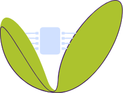

<div id="top"></div>

[![Contributors][contributors-shield]][contributors-url]
[![Forks][forks-shield]][forks-url]
[![Stargazers][stars-shield]][stars-url]
[![Issues][issues-shield]][issues-url]
[![MIT License][license-shield]][license-url]
[![LinkedIn][linkedin-shield]][linkedin-url]


<!-- PROJECT LOGO -->
<br />
<div align="center">
  <a href="https://github.com/chinmoym2004/agri-project-iot/tree/advance">
    
  </a>

  <h3 align="center">AgriTech: Farm Water Management</h3>

  <p align="center">
    This is an IoT project that might help to jump start your next farming
    <br />
    <a href="https://github.com/chinmoym2004/agri-project-iot"><strong>Explore the docs »</strong></a>
    <br />
    <br />
    <a href="https://github.com/chinmoym2004/agri-project-iot">View Demo</a>
    ·
    <a href="https://github.com/chinmoym2004/agri-project-iot/issues">Request Feature</a>
  </p>
</div>


<!-- TABLE OF CONTENTS -->
<details>
  <summary>Table of Contents</summary>
  <ol>
    <li>
      <a href="#about-the-project">About The Project</a>
      <ul>
        <li><a href="#built-with">Built With</a></li>
      </ul>
    </li>
    <li>
      <a href="#getting-started">Getting Started</a>
      <ul>
        <li><a href="#prerequisites">Prerequisites</a></li>
        <li><a href="#installation">Installation</a></li>
      </ul>
    </li>
    <li><a href="#usage">Usage</a></li>
    <li><a href="#roadmap">Roadmap</a></li>
    <li><a href="#contributing">Contributing</a></li>
    <li><a href="#license">License</a></li>
    <li><a href="#contact">Contact</a></li>
    <li><a href="#acknowledgments">Acknowledgments</a></li>
  </ol>
</details>


<!-- ABOUT THE PROJECT -->
## About The Project

[![Agri101 Screen Shot][product-screenshot]](https://github.com/chinmoym2004/agri-project-iot/tree/advance)

Maintaining the right balance between water consumption and soil moisture management is crucial to get a good crop yield at efficient costs. We’ll develop an automatic sprinkler system based on soil and air parameters, with information coming from embedded sensors.

We are helping AgriTech101 to develop an innovative solution for farm water Management.


<p align="right">(<a href="#top">back to top</a>)</p>


### Built With

List of things the are part of this project

* [Python3](https://www.python.org/)
* [Flask](https://flask.palletsprojects.com/en/2.0.x/)
* [Boto3](https://boto3.amazonaws.com/)
* [Bootstrap](https://getbootstrap.com)
* [JQuery](https://jquery.com)
* [Open Weather Map](https://openweathermap.org/api)
* [AWS](https://console.aws.amazon.com/)

<p align="right">(<a href="#top">back to top</a>)</p>


<!-- GETTING STARTED -->
## Getting Started

This will show you how to run this application on your local system successfully. 

### Prerequisites

* AWS account 

_You should have an actual AWS account or AWS Student Account to perform the following action._

1. From the given .env.example create .env file in the same location 
2. Open \~/.aws/credential file and update the details like this 

  ```sh
    [default]
    aws_access_key_id=<UR ACCOUNT KEY>
    aws_secret_access_key=<ACCOUNT SECRET>
    aws_session_token=<ACCESS TOEK WITH ALL PERMISSION>
    region=<UR REGION i.e. us-east-1 or us-east-2>
  ```
3. In your AWS account you should have a rule under [IoT/Act](https://console.aws.amazon.com/iot/home?region=us-east-1#/rulehub) that ready data from iot/agritech MQTT topic and push to "soildata" table

4. Get the eng point from [IoT Settings](https://console.aws.amazon.com/iot/home?region=us-east-1#/settings) and set in .env for ENDPOINT

5. Install all python dependency from the requirements.txt file 

6. Get API key from [OpenWeatherAPI](https://openweathermap.org/api) and set in .env for OPEN_WEATHER_API_KEY

7. You can modify the other values in .env as you wish. 

### Run the application 

_Below is the steps to run the application. Move to the application directory_

1. First we'll create tables & the Things in IoT from the code . To do that , run 
```sh
python3 console/src/createTables.py
```
[![Create table ss][createtable-screenshot]](https://github.com/chinmoym2004/agri-project-iot/tree/advance)

2. Once the above action success then we'll start pushing the data from the Sprinkler and publish to MQTT. Run 
```sh
python3 console/src/ssPublishData.py
```
[![Publish Data to the MQTT & table ss][publish-screenshot]](https://github.com/chinmoym2004/agri-project-iot/tree/advance)

3. Keep the above thing running for as long as you with (timeout set to 2 hrs so the program will exit after 2 hrs if you don't take any action). You should see data being pushed like this 

4. Open a new tab and tun 
```sh
  python3 console/src/SprinklerCallV2.py
```
[![Decission making for the Sprinkler based on the soil sensor data and weather humidity][sprinkler-screenshot]](https://github.com/chinmoym2004/agri-project-iot/tree/advance)


<p align="right">(<a href="#top">back to top</a>)</p>


<!-- MARKDOWN LINKS & IMAGES -->
<!-- https://www.markdownguide.org/basic-syntax/#reference-style-links -->
[contributors-shield]: https://img.shields.io/github/contributors/othneildrew/Best-README-Template-new.svg?style=for-the-badge
[contributors-url]: https://github.com/chinmoym2004/agri-project-iot/graphs/contributors
[forks-shield]: https://img.shields.io/github/forks/othneildrew/Best-README-Template.svg?style=for-the-badge
[forks-url]: https://github.com/othneildrew/Best-README-Template/network/members
[stars-shield]: https://img.shields.io/github/stars/othneildrew/Best-README-Template.svg?style=for-the-badge
[stars-url]: https://github.com/othneildrew/Best-README-Template/stargazers
[issues-shield]: https://img.shields.io/github/issues/othneildrew/Best-README-Template.svg?style=for-the-badge
[issues-url]: https://github.com/othneildrew/Best-README-Template/issues
[license-shield]: https://img.shields.io/github/license/othneildrew/Best-README-Template.svg?style=for-the-badge
[license-url]: https://github.com/othneildrew/Best-README-Template/blob/master/LICENSE.txt
[linkedin-shield]: https://img.shields.io/badge/-LinkedIn-black.svg?style=for-the-badge&logo=linkedin&colorB=555
[linkedin-url]: https://linkedin.com/in/chinmoym2004
[product-screenshot]: ss.png
[createtable-screenshot]: createtable.png
[publish-screenshot]: publish.png
[sprinkler-screenshot]: sprinkler.png